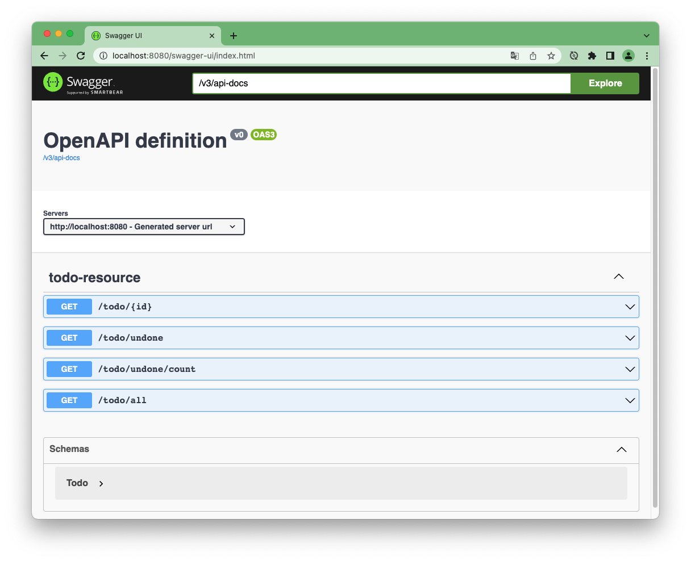

# Spring Boot - Todo List

Application exploitant des *profiles* pour stocker ses données dans différentes bases.

## Lancement de l'application

````sh
mvn spring-boot:run
````

NB : Il faut Java (JDK) 17 ou plus.  
Si erreur, le vérifier avec `mvn -version`

## Services REST

L'application embarque un Swagger qui documente les Endpoints :  
http://localhost:8080/swagger-ui.html



## Profiles

### Profile dev (par défaut)

Lancement :

````sh
mvn spring-boot:run
````

Les données sont stockées dans une base H2 embarquées. La base est initialisée par Spring à partir du fichier [data.sql](src/main/resources/data.sql)

C'est aussi le mode utilisé par le test (`mvn test`) qui est basé sur les valeurs de ce fichier.

### Profile *compose*

#### Lancer la base MySql

````sh
docker-compose up -d
````

Bien entendu, il faut Docker et Docker-compose...

La base MySQL est exposée sur le port 6033, et un client PhpMyAdmin est également lancé (port 8081 de l'hôte).  
Cf. le [fichier docker-compose.yml](docker-compose.yml) pour les détails et mots de passe.

Le [fichier docker-compose-init.sql](docker-compose-init.sql) est lancé (directement via docker-compose, sans passer par Spring) pour peupler la base.

#### Lacement de l'application Spring Boot

````sh
mvn spring-boot:run -P compose
````

Cette fois-ci, l'application Spring va accéder aux données via la base MySQL (et le driver ad hoc)  
Le code Java de l'application est strictement le même.

Cf. les [fichiers de properties](src/main/resources) et le [fichier pom.xml](pom.xml) 

